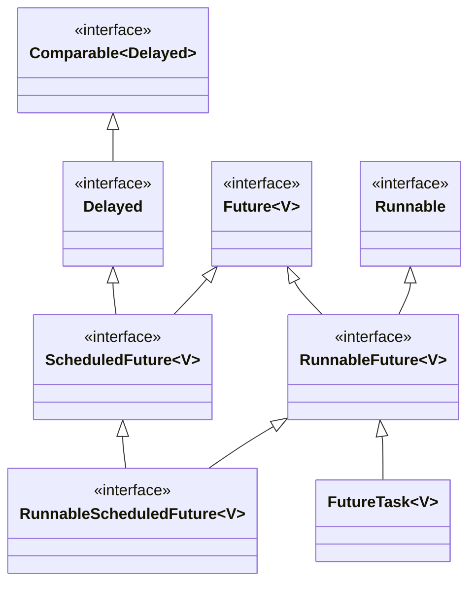
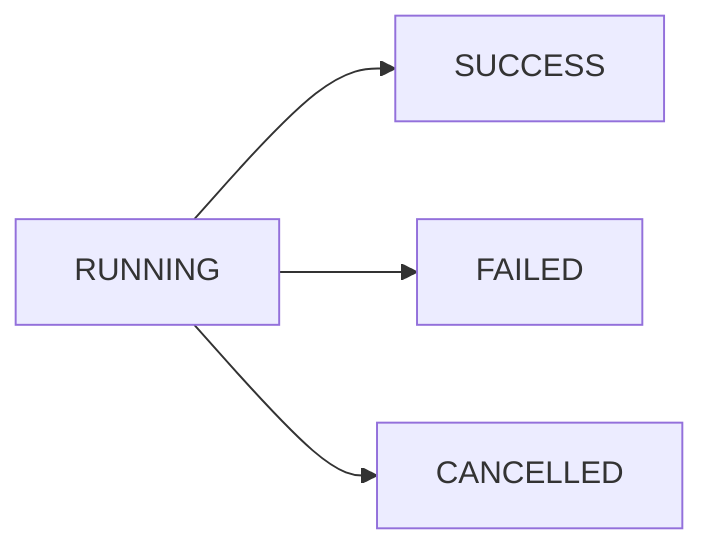

`Future` class represents a future result of an asynchronous computation.




## Future State

It represents the computation state.




| Enum Constant | Description                          |
| ------------- | ------------------------------------ |
| RUNNING       | The task has not completed           |
| SUCCESS       | The task completed with a result     |
| FAILED        | The task completed with an exception |
| CANCELLED     | The task was cancelled               |


# Future Task

`FutureTask` class is the implementation of `Future` that implements `Runnable`.
A `FutureTask` can be submitted to an `Executor` for execution.

## Constructors

`FutureTask` can be used to wrap a `Callable` or `Runnable` object.

| Constructor                               | Description                                                                                                                                              |
| ----------------------------------------- | -------------------------------------------------------------------------------------------------------------------------------------------------------- |
| `FutureTask(Runnable runnable, V result)` | Creates a `FutureTask` that will execute the given `Runnable`upon running, and arrange that `get` will return the given result on successful completion. |
| `FutureTask(Callable<V> callable)`        | Creates a `FutureTask` that will execute the given `Callable` upon running.                                                                              |


## Implementing `Future` with `FutureTask`

- Submit `Callable` instance to an `ExecutorService` 
- `ExecutorService` will take care of starting the `Callable` task in a new thread
- It will return a `FutureTask` object which represents the pending results of the task

```java
public class SquareCalculator {    
    
    private ExecutorService executor = Executors.newSingleThreadExecutor();
    
    public Future<Integer> calculate(Integer input) {        
        return executor.submit(() -> {
            Thread.sleep(1000);
            return input * input;
        });
    }
}
```


## Methods

| Type      | Method     | Decription                                                                         |
| --------- | ---------- | ---------------------------------------------------------------------------------- |
| `boolean` | `isDone()` | Returns `true` if the task is completed                                            |
| `V`       | `get()`    | Blocks the execution until the task is complete and then returns the actual result |

```java
Future<Integer> future = new SquareCalculator().calculate(10);

while(!future.isDone()) {
    System.out.println("Calculating...");
    Thread.sleep(300);
}

Integer result = future.get();
```

| Type | Method                             | Decription                                                                                                                  |
| ---- | ---------------------------------- | --------------------------------------------------------------------------------------------------------------------------- |
| `V`  | `get(long timeout, TimeUnit unit)` | Waits if necessary for at most the given time for the computation to complete, and then retrieves its result, if available. |

The `get()` has an overloaded version that takes a timeout and a `TimeUnit` as the argument. It will throw a `TimeoutException` if the task doesn't return before the specified timeout period.

```java
Integer result = future.get(500, TimeUnit.MILLISECONDS);
```

| Type      | Method                                  | Decription                                                              |
| --------- | --------------------------------------- | ----------------------------------------------------------------------- |
| `boolean` | `isCancelled()`                         | Returns `true` if this task was cancelled before it completed normally. |
| `boolean` | `cancel(boolean mayInterruptIfRunning)` | Attempts to cancel execution of this task.                              |

Suppose we triggered a task, but for some reason, we don’t care about the result anymore. We can tell the `ExecutorService` to stop the operation and interrupt its underlying thread.

```java
Future<Integer> future = new SquareCalculator().calculate(4);
boolean canceled = future.cancel(true);
```

It’s important to note that `cancel()` takes a `boolean` value as an argument. This controls whether the thread executing the task should be interrupted or not. If `cancel()` is called upon the task that has not started yet, then this task should never run.

It’s also possible that a call to `cancel()` fails, typically because it has already completed or cancelled. In that case, the returned value will be `false`, otherwise it will return `true`. If two or more threads cause a task to be cancelled, then at least one of them returns `true`.

From the above code, if we try to call `get()` from the `Future` instance, the outcome will be `CancellationException`. In order to avoid getting a `CancellationException`, `isCancelled()` is used to check if `Future` instance is already cancelled.


# Completable Future

It implements the `Future` interface but with additional completion logic provided by `CompletionStage` interface.

It performs possible asynchronous computation and trigger dependant computations which could also be asynchronous.

`CompletionStage` is a stage of a possibly asynchronous computation, that performs an action or computes a value when another `CompletionStage` completes. A stage completes upon termination of its computation, but this may in turn trigger other dependent stages.

`CompletableFuture` is a building block and a framework for composing, combining, and executing asynchronous computation steps and handling errors.

## Using `CompletableFuture` as a Simple `Future`

```java
public Future<String> calculateAsync() throws InterruptedException {
    CompletableFuture<String> completableFuture = new CompletableFuture<>();

    Executors.newCachedThreadPool().submit(() -> {
        Thread.sleep(500);
        completableFuture.complete("Hello");
        return null;
    });

    return completableFuture;
}
```


