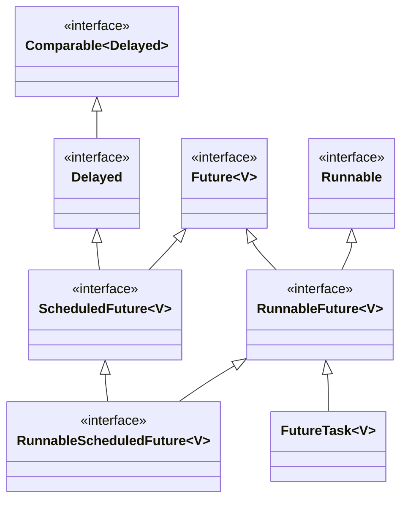
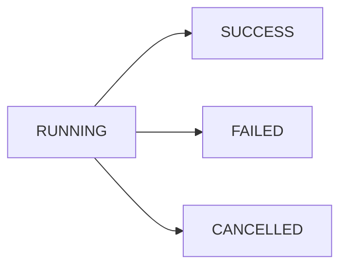

`Future` class represents a future result of an asynchronous computation.




## Future State

It represents the computation state.




| Enum Constant | Description                          |
| ------------- | ------------------------------------ |
| RUNNING       | The task has not completed           |
| SUCCESS       | The task completed with a result     |
| FAILED        | The task completed with an exception |
| CANCELLED     | The task was cancelled               |


# Future Task

`FutureTask` class is the implementation of `Future` that implements `Runnable`.
A `FutureTask` can be submitted to an `Executor` for execution.

## Constructors

`FutureTask` can be used to wrap a `Callable` or `Runnable` object.

| Constructor                               | Description                                                                                                                                              |
| ----------------------------------------- | -------------------------------------------------------------------------------------------------------------------------------------------------------- |
| `FutureTask(Runnable runnable, V result)` | Creates a `FutureTask` that will execute the given `Runnable`upon running, and arrange that `get` will return the given result on successful completion. |
| `FutureTask(Callable<V> callable)`        | Creates a `FutureTask` that will execute the given `Callable` upon running.                                                                              |


## Implementing `Future` with `FutureTask`

- Submit `Callable` instance to an `ExecutorService` 
- `ExecutorService` will take care of starting the `Callable` task in a new thread
- It will return a `FutureTask` object which represents the pending results of the task

```java
public class SquareCalculator {    
    
    private ExecutorService executor = Executors.newSingleThreadExecutor();
    
    public Future<Integer> calculate(Integer input) {        
        return executor.submit(() -> {
            Thread.sleep(1000);
            return input * input;
        });
    }
}
```


## Methods

| Type      | Method     | Decription                                                                         |
| --------- | ---------- | ---------------------------------------------------------------------------------- |
| `boolean` | `isDone()` | Returns `true` if the task is completed                                            |
| `V`       | `get()`    | Blocks the execution until the task is complete and then returns the actual result |

```java
Future<Integer> future = new SquareCalculator().calculate(10);

while(!future.isDone()) {
    System.out.println("Calculating...");
    Thread.sleep(300);
}

Integer result = future.get();
```

| Type | Method                             | Decription                                                                                                                  |
| ---- | ---------------------------------- | --------------------------------------------------------------------------------------------------------------------------- |
| `V`  | `get(long timeout, TimeUnit unit)` | Waits if necessary for at most the given time for the computation to complete, and then retrieves its result, if available. |

The `get()` has an overloaded version that takes a timeout and a `TimeUnit` as the argument. It will throw a `TimeoutException` if the task doesn't return before the specified timeout period.

```java
Integer result = future.get(500, TimeUnit.MILLISECONDS);
```

| Type      | Method                                  | Decription                                                              |
| --------- | --------------------------------------- | ----------------------------------------------------------------------- |
| `boolean` | `isCancelled()`                         | Returns `true` if this task was cancelled before it completed normally. |
| `boolean` | `cancel(boolean mayInterruptIfRunning)` | Attempts to cancel execution of this task.                              |

Suppose we triggered a task, but for some reason, we don’t care about the result anymore. We can tell the `ExecutorService` to stop the operation and interrupt its underlying thread.

```java
Future<Integer> future = new SquareCalculator().calculate(4);
boolean canceled = future.cancel(true);
```

It’s important to note that `cancel()` takes a `boolean` value as an argument. This controls whether the thread executing the task should be interrupted or not. If `cancel()` is called upon the task that has not started yet, then this task should never run.

It’s also possible that a call to `cancel()` fails, typically because it has already completed or cancelled. In that case, the returned value will be `false`, otherwise it will return `true`. If two or more threads cause a task to be cancelled, then at least one of them returns `true`.

From the above code, if we try to call `get()` from the `Future` instance, the outcome will be `CancellationException`. In order to avoid getting a `CancellationException`, `isCancelled()` is used to check if `Future` instance is already cancelled.


# Completable Future

`CompletableFuture` is a class introduced in Java 8 that allows us to write asynchronous, non-blocking code. It implements the `Future` and `CompletionStage` interface. It represents a future result of an asynchronous computation. It can be thought of as a container that holds the result of an asynchronous operation that is being executed in a different thread.

`CompletableFuture` is a building block and a framework which provides a number of methods for composing, combining, and executing asynchronous computation steps and handling errors.

## Using `CompletableFuture` as a Simple `Future`

```java
public Future<String> calculateAsync() throws InterruptedException {
    CompletableFuture<String> completableFuture = new CompletableFuture<>();

    Executors.newCachedThreadPool().submit(() -> {
        Thread.sleep(500);
        completableFuture.complete("Hello");
        return null;
    });

    return completableFuture;
}
```

## Future vs CompletableFuture

1. **Blocking vs non-blocking:** `Future` is a blocking API, whereas `CompletableFuture` is non-blocking. With a `Future` object, you must call the `get()` method to retrieve the result, but this method blocks until the result is available. In contrast, with a `CompletableFuture object`, you can use various non-blocking methods to retrieve the result, such as `thenApply()`, `thenAccept()`, or `join()`.
2. **Composition:** `CompletableFuture` provides a more powerful composition API than `Future`. With `Future`, it is difficult to chain multiple asynchronous operations together or to combine the results of multiple operations. `CompletableFuture`, on the other hand, provides methods such as `thenCompose()`, `thenCombine()`, and `allOf()` that make it easy to compose multiple asynchronous operations and to handle their results in a non-blocking way.
3. **Exception Handling:** `CompletableFuture` provides better exception handling than `Future`. With `Future`, you can only check if the computation completed successfully or not. If an exception occurs during the computation, you have to catch it explicitly. In contrast, with `CompletableFuture`, you can handle exceptions in a more declarative way using methods like `exceptionally()` and `handle()`.
4. **Completion:** With a `Future` object, there is no way to explicitly complete the future. Once you submit a task to an executor service and get a `Future` object in return, you can only wait for the task to complete. With `CompletableFuture`, you have more control over the completion of the future. You can complete it explicitly by calling `complete()`, `completeExceptionally()`, or `cancel()` methods.

In summary, CompletableFuture provides a more flexible and powerful API for working with asynchronous computations than Future. It offers non-blocking methods, composition methods, better exception handling, and explicit completion methods, which makes it easier to write robust and scalable concurrent code.

## `runAsync()`

- `runAsync()` is a method used to execute a task asynchronously that doesn’t produce a result.
- By default task gets executed in the `ForkJoinPool.commonPool()`.
- It accepts a `Runnable` functional interface and returns a `CompletableFuture<Void>`.
- It’s suitable for fire-and-forget tasks where we want to execute code asynchronously without waiting for a result. For example, logging, sending notifications, or triggering background tasks.
- The method doesn’t provide an explicit mechanism for handling exceptions within the asynchronous task.
- Any exceptions thrown during the execution of the task are propagated to the calling thread when invoking the `get()` method on the `CompletableFuture`.
- Execution of task begins immediately upon invocation, without any delay or scheduling considerations.
- `runAsync()` method can be directly chained with methods like `thenRun()` to execute another task after the completion of its task.

## `supplyAsync()`

- `supplyAsync()` is a method used to execute a task asynchronously that produces a result.
- By default task gets executed in the `ForkJoinPool.commonPool()`.
- It accepts a `Supplier` functional interface and returns a `CompletableFuture<T>`, where T is the type of the result produced by the task.
- It’s ideal for tasks that require a result for further processing. For example, fetching data from a database, making an API call, or performing a computation asynchronously.
- It offers an exception-handling mechanism via the `exceptionally()` method.
- We can use this function to handle the exception thrown during the execution of the asynchronous task and return a default value or perform any necessary cleanup operations.
- `supplyAsync()` ensures efficient resource utilization by queuing tasks and scheduling their execution based on the availability of threads.
- `supplyAsync()` method can be directly chained with methods like `thenApply()` to transform the result, `thenAccept()` to consume the result or `thenCompose()` to chain further asynchronous operations.
- This flexibility enables us to build complex asynchronous workflows by chaining multiple tasks together.

