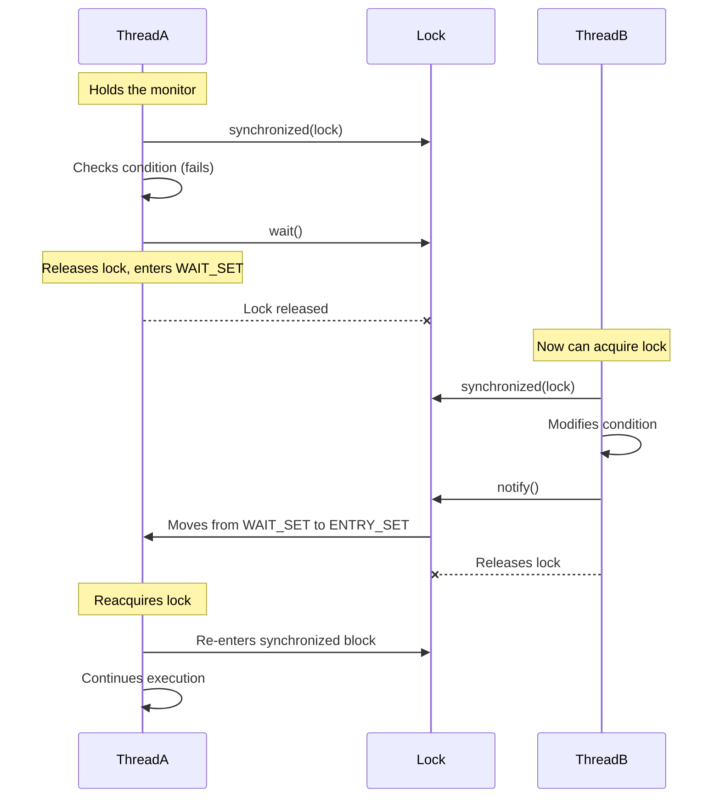

- **`wait()`**, **`notify()`** and **`notifyAll()`** are fundamental for **thread coordination** in Java.
- They **must** be called inside `synchronized` blocks to avoid `IllegalMonitorStateException`.

> [!question] Why is the Monitor Lock Required?
> - These methods (`wait`, `notify`, `notifyAll`) are used for **thread coordination** and must be called **only when the thread holds the object's monitor** (i.e., inside a `synchronized` block/method).
> - The monitor ensures that only one thread can modify the object's state at a time, preventing race conditions.

# `wait()` - The Waiting Mechanism

1. **Releases the monitor lock** (unlike `sleep()` which holds it).
2. **Moves the thread into the "Wait Set"** (a special queue for waiting threads).
3. **Blocks until another thread calls `notify()` or `notifyAll()`** (or until a timeout occurs if using `wait(timeout)`).

> [!note]
> - Must be called inside `synchronized`.
> - Temporarily **releases the lock** and waits for notification.

## Working with Monitor

**At runtime**, the JVM explicitly checks whether the current thread holds the lock before allowing `wait()`, **If yes**, the JVM:
- Records the thread’s ownership status.
- Safely releases the lock and moves the thread to the **Wait Set**.

When `wait()` is called **correctly** (inside `synchronized`), the sequence is **atomic**:
1. **Acquire the lock** (`synchronized` ensures this).
2. **Check the condition** (e.g., `while (!condition)`).
3. **Release the lock and wait** (`wait()` does this atomically).
4. **Reacquire the lock** when notified and recheck the condition.

```java
synchronized (lock) {      // 1. Acquire lock
	// Always use a loop to avoid spurious wakeups
    while (!condition) {   // 2. Check condition (atomic)
        lock.wait();       // 3. Release lock & wait
    }
    // 4. Reacquire lock on wakeup
}
```

> [!note]
> - The **check-then-wait** operation is **atomic** (no other thread can interfere between steps 2 and 3).
> - The lock is **released only after the thread is safely in the wait state**.
> - Always use **`while` loops** (not `if`) to handle **spurious wakeups**.

> [!question]
> # What Happens If `wait()` Is Called Without the Lock?

> Throw `IllegalMonitorStateException`

**At runtime**, the JVM explicitly checks whether the current thread holds the lock before allowing `wait()`, If **no**, then it throws `IllegalMonitorStateException`.

```java
// ❌ Hypothetical (invalid) code
if (!condition) {
    lock.wait();  // Called without synchronized
}
```

If `wait()` were allowed without synchronization:

1. **No Guarantee of Atomicity (Race condition)**
    - Another thread could modify shared state between the condition check and `wait()`.
    - This is called a **"lost wakeup"** problem.

```java
if (!condition) {       // Check
    // <-- Another thread sets `condition=true` and calls `notify()` here!
    lock.wait();        // Missed signal → waits forever!
}
```


2. **Monitor Corruption Risk**
	- The JVM internally tracks which thread owns the monitor.
    - `wait()` **must release the lock** to allow other threads to call `notify()`.
    - If `wait()` tried to release a lock the thread **doesn’t own**, it could corrupt synchronization state.
    - If the thread doesn’t acquire the lock, the JVM **cannot release it safely** → hence `IllegalMonitorStateException`.

3. **Thread Safety Violation**
    - The monitor ensures **only one thread executes critical sections at a time**.
    - Allowing `wait()` without synchronization would let multiple threads manipulate wait/notify states **unsafely**.


# `notify()` & `notifyAll()` – The Wake-Up Calls

1. For all threads waiting on the object’s monitor, `notify()` wakes up a single random thread.
2. The choice of exactly which thread to wake is nondeterministic and depends upon the implementation.
3. `notifyAll()` wakes all threads that are waiting on the object’s monitor.
4. The awakened threads will compete in the usual manner, like any other thread that is trying to synchronize on this object.

> [!note]
> - Must be called inside `synchronized`.
> - Wakes up **one (`notify`) or all (`notifyAll`)** waiting threads.

```java
synchronized (lock) {
    condition = true;
    lock.notify();  // Wakes one waiting thread
    // lock.notifyAll();  // Wakes all waiting threads
}
```
# The Full Lifecycle of `wait()` and `notify()`

Let’s see how threads interact with the monitor:

1. **Thread A** enters `synchronized` and acquires the lock.
2. **Thread A** checks a condition and calls `wait()` if not met:
    - Releases the lock.
    - Moves to the **Wait Set**.
3. **Thread B** acquires the lock, modifies the condition, and calls `notify()`.
4. **Thread A** wakes up, **re-acquires the lock**, and continues execution.


```java
synchronized (lock) {           // 1. Thread acquires the lock
    while (!condition) {        // 2. Checks condition (atomic)
        lock.wait();            // 3. Releases lock & waits
    }                           // 4. After notify(), reacquires lock & rechecks
    // Proceed safely
}
```




# Common Pitfalls & Best Practices

## Pitfalls

❌ **Calling `wait()`/`notify()` without synchronization** → `IllegalMonitorStateException`.  
❌ **Assuming `notify()` wakes a specific thread** (it’s random).  
❌ **Using `if` instead of `while` for condition checks** (can lead to **spurious wakeups**).

## Best Practices

✅ **Always use `synchronized` with `wait()`/`notify()`.**  
✅ **Use `while` loops for condition checks** (handles spurious wakeups).  
✅ **Prefer `notifyAll()`** unless you have a good reason to use `notify()`.


> [!question] Why Enclose wait() in a while Loop?
> Since `notify()` and `notifyAll()` randomly wake up threads that are waiting on this object’s monitor, it’s not always important that the condition is met. Sometimes the thread is woken up, but the condition isn’t actually satisfied yet. 
> 
> We can also define a check to save us from spurious wakeups — where a thread can wake up from waiting without ever having received a notification.
