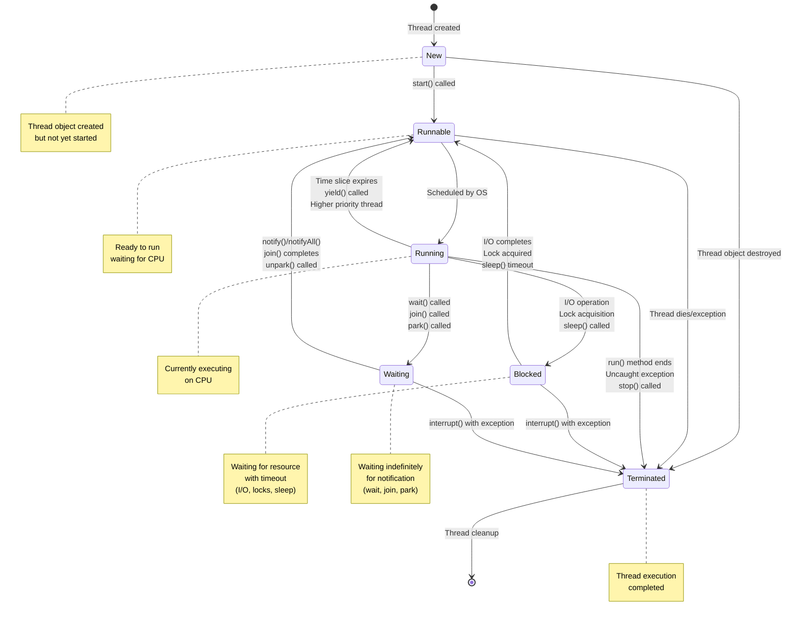

==**NEW**==: Thread object is created but `start()` hasn't been called yet. The thread exists but isn't eligible for execution.

==**RUNNABLE**==: Thread is ready to run and waiting for CPU time. This includes threads that are actively competing for processor time.

==**RUNNING**==: Thread is currently executing on the CPU. It has been selected by the thread scheduler and is actively running code.

==**BLOCKED**==: Thread is temporarily suspended and waiting for a specific condition or resource. This includes waiting for I/O operations, lock acquisition, or sleep().

==**WAITING**==: Thread is waiting indefinitely for a specific condition or notification (like wait(), join(), or park()).

==**TERMINATED**==: Thread has completed execution either normally (run method finished) or abnormally (due to exceptions or being stopped).

The arrows show the possible transitions between states, with labels indicating what triggers each transition. For example, calling `start()` moves a thread from NEW to RUNNABLE, while calling `wait()` moves it from RUNNING to BLOCKED.

This state diagram illustrates the complete thread life cycle with five main states:

