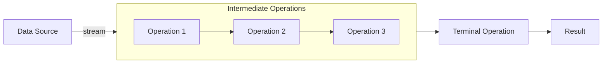
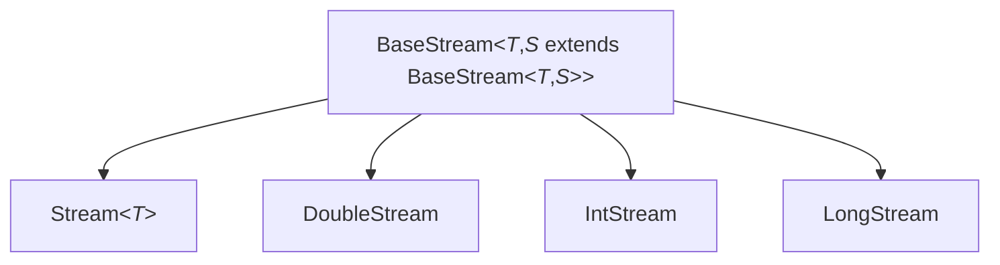
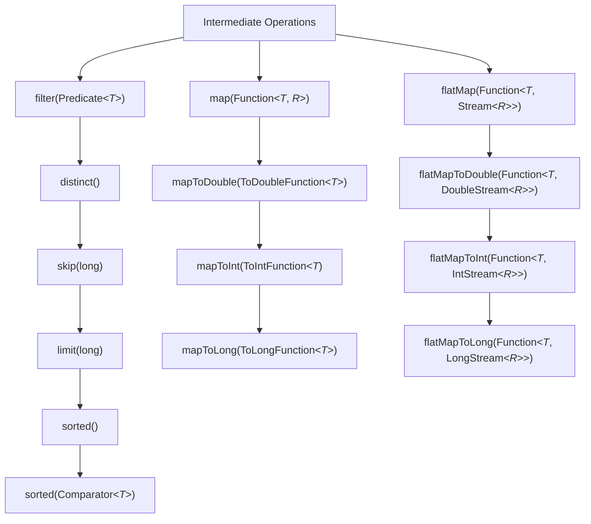
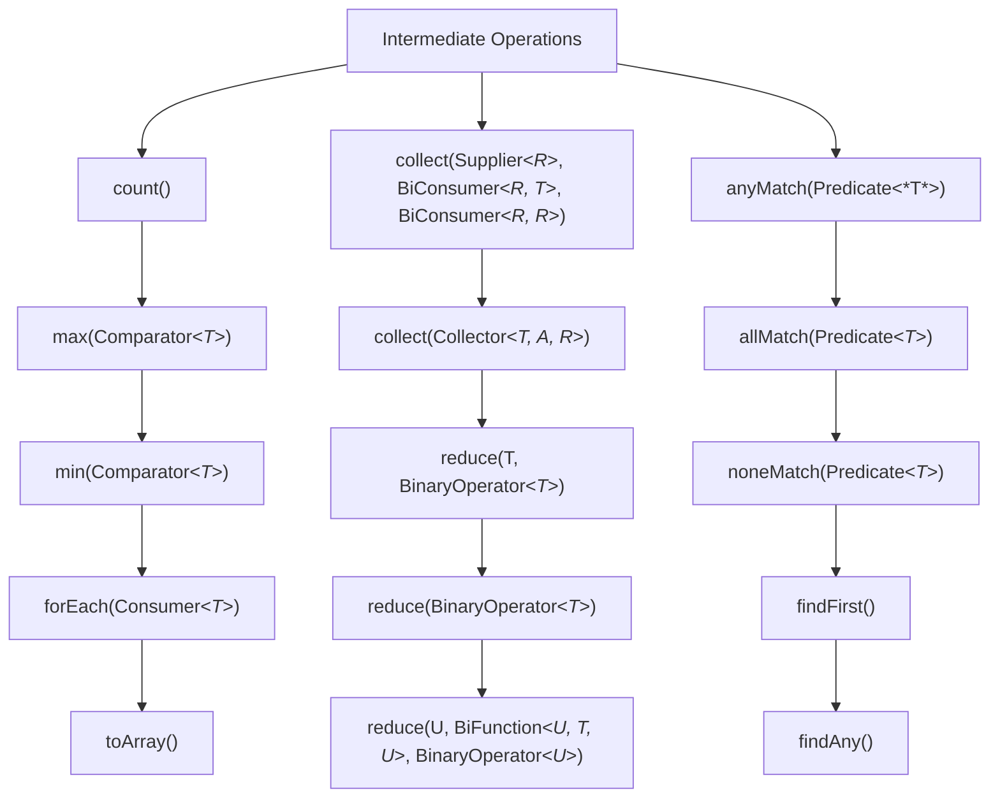
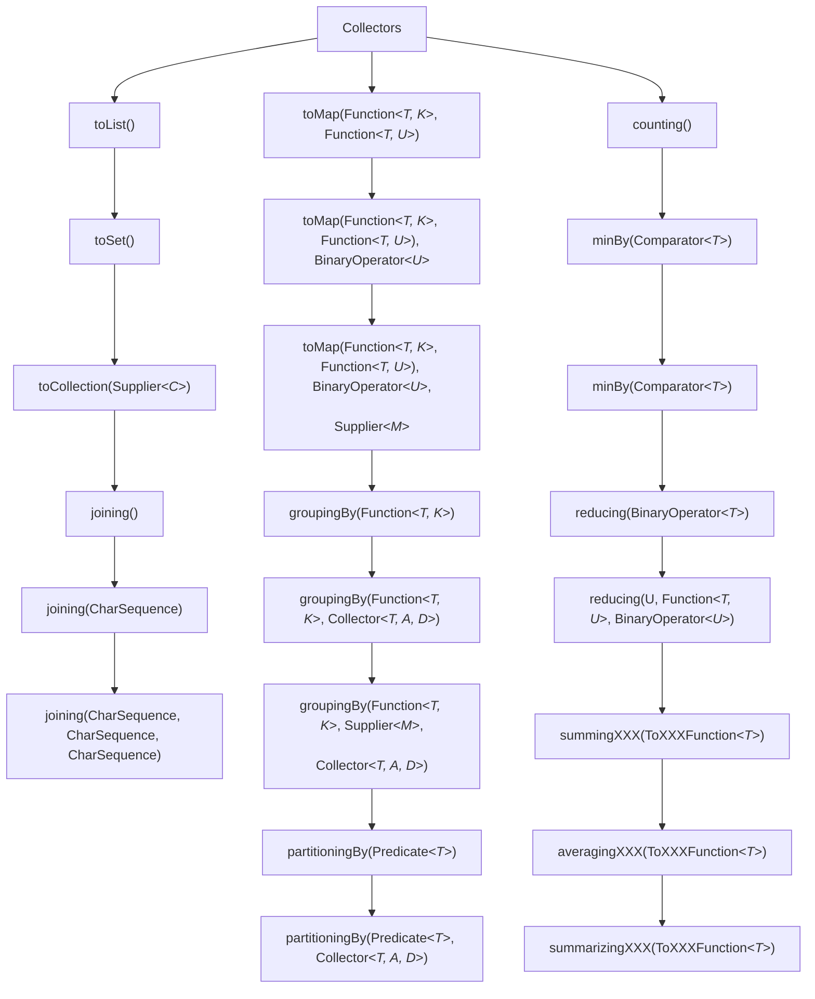

> [!todo] Todo list:
>- [ ]  Parallel streams

Stream API is used to perform various operations on the collections of objects to produce the desired result like filtering, mapping, reducing, sorting, etc.

# Benefits of Java Stream

There are some benefits because of which we use Stream in Java as mentioned below:
- Can be created from collections, arrays, Files Lines, Methods in Stream, IntStream etc.
- No Storage
- Pipeline of Functions
- Lazy Invocations
- Can be infinite
- Can be parallelized


# Stream Pipeline

To perform a sequence of operations over the elements of the data source and aggregate their results, we need three parts:
- [[Stream API#Stream Source|Stream Source]]
- [[Stream API#Intermediate Operation(s)|Intermediate Operation(s)]]
- [[Stream API#Terminal Operation|A Terminal Operation]]

>[!info] Stream pipeline is a chain of the stream source, intermediate operations, and a terminal operation.



# Stream Source

## Empty Stream

We should use the `empty()` method in case of the creation of an empty stream:

```java
Stream<String> streamEmpty = Stream.empty();
```

We often use the `empty()` method upon creation to avoid returning _null_ for streams with no element:

```java
public Stream<String> streamOf(List<String> list) {
    return list == null || list.isEmpty() ? Stream.empty() : list.stream();
}
```

## Stream of Collection

```java
Collection<String> collection = Arrays.asList("a", "b", "c");
Stream<String> streamOfCollection = collection.stream();
```

## Stream of Array of Objects

An array can also be the source of a stream:

```java
Stream<String> streamOfArray = Stream.of("a", "b", "c");

String[] names = new String[] {"John", "Doe"};
Stream<String> streamOfArray = Stream.of(names);
```

We can also create a stream out of an existing array or of part of an array:

```java
String[] arr = new String[]{"a", "b", "c"};
Stream<String> streamOfArrayFull = Arrays.stream(arr);
Stream<String> streamOfArrayPart = Arrays.stream(arr, 1, 3);
```

## Stream of Array of Primitives




As `Stream<T>` is a generic interface, and there is no way to use primitives as a type parameter with generics, three new special interfaces were created: **_IntStream, LongStream, DoubleStream_** for three primitive types: _int, long_ and _double_ respectively.

```java
int[] nums = new int[] {1, 2, 3};
IntStream intStream = IntStream.of(nums);
IntStream intStream = IntStream.of(1, 2, 3, 4);

IntStream intStream = IntStream.range(1, 3);
LongStream longStream = LongStream.rangeClosed(1, 3);
```


## Stream Util Methods

### Stream._of()_

An array can also be the source of a stream:

```java
Stream<String> streamOfArray = Stream.of("a", "b", "c");
```

### Stream._builder()_

When builder is used, the desired type should be additionally specified in the right part of the statement, otherwise the `build()` method will create an instance of the `Stream<Object>`:

```java
Stream<String> streamBuilder = Stream.<String>builder().add("a")
		.add("b").add("c").build();
```

### Stream._generate()_

The `generate()` method accepts a `Supplier<T>` for element generation. As the resulting stream is infinite, the developer should specify the desired size, or the `generate()` method will work until it reaches the memory limit:

```java
Stream<String> streamGenerated = Stream.generate(() -> "element").limit(10);
```

The code above creates a sequence of ten strings with the value _“element.”_

### Stream._iterate()_

Another way of creating an infinite stream is by using the `iterate()` method:

```java
Stream<Integer> streamIterated = Stream.iterate(40, n -> n + 2).limit(20);
```

The first element of the resulting stream is the first parameter of the `iterate()` method. When creating every following element, the specified function is applied to the previous element. In the example above the second element will be 42.

# Intermediate Operation(s)

Intermediate Operations are the types of operations in which multiple methods are chained in a stream pipeline.

Intermediate operations return a new modified stream on which further processing can be done. This means If we need more than one modification, we can chain intermediate operations.

```java
IntStream.rangeClosed(1, 20).filter(i -> i % 2 == 0).skip(2).limit(5).count()
```

**Intermediate operations are lazy.** This means that they’re not executed until the terminal operation is initiated.

>[!example]

```java
List<String> list = Arrays.asList(“abc1”, “abc2”, “abc3”);
Stream<String> stream = list.stream().filter(element -> {
    log.info("element: " + element);
    return element.contains("2");
});
```

As we have a source of three elements, we can assume that the `filter()` method will be called three times, and it will log every element. However, running this code doesn’t log at all, so the `filter()` method wasn’t even called once. This is because terminal operation is missing.



>[!note]
>Intermediate operations which reduce the size of the stream should be placed before operations which are applying to each element. So we need to keep methods such as `skip()`, `filter()`, and `distinct()` at the top of our stream pipeline.


# Terminal Operation

When we instantiate a stream, we can have an accessible reference to the stream, as long as only intermediate operations are called. Executing a terminal operation makes a stream inaccessible.

Terminal operations mark the stream as consumed and return the result, after which stream can no longer be used. 

However, an attempt to reuse the same stream after calling the terminal operation will trigger the `IllegalStateException`:

```java
Stream<String> stream = Stream.of("a", "b", "c")
		.filter(element -> element.contains("b"));
Optional<String> anyElement = stream.findAny();
Optional<String> firstElement = stream.findFirst();
```

As the `IllegalStateException` is a `RuntimeException`, a compiler will not indicate a problem. This kind of behavior is logical. We designed streams to apply a finite sequence of operations to the source of elements in a functional style, not to store elements.


>[!note]
>- We can only use one terminal operation per stream.
>- **Java 8** streams can’t be reused.



# Stream Reduction

The API has many terminal operations which aggregate a stream to a type or to a primitive: `count()`, `max()`, `min()`,  and `sum()`.

However, these operations work according to the predefined implementation. There are two methods which allow us to customize a Stream’s reduction mechanism:
- `reduce()`
- `collect()`

## reduce() Method

There are three variations of this method, which differ by their signatures and returning types.

```java
T reduce(T identity, BinaryOperator<T> accumulator)

Optional<T> reduce(BinaryOperator<T> accumulator);

<U> U reduce(U identity, BiFunction<U, ? super T, U> accumulator,
		BinaryOperator<U> combiner);
```

They can have the following parameters:

- **identity –** the initial value for an accumulator, or a default value if a stream is empty and there is nothing to accumulate

- **accumulator –** a function which specifies the logic of the aggregation of elements. As the accumulator creates a new value for every step of reducing, the quantity of new values equals the stream’s size and only the last value is useful. This is not very good for the performance.

- **combiner –** a function which aggregates the results of the accumulator. We only call combiner in a parallel mode to reduce the results of accumulators from different threads.

>[!example]

Now let’s look at these three methods in action:

```java
OptionalInt reduced = IntStream.range(1, 4).reduce((a, b) -> a + b);

// reduced = 6 (1 + 2 + 3)
```

```java
int reducedTwoParams = IntStream.range(1, 4).reduce(10, (a, b) -> a + b);
// reducedTwoParams = 16 (10 + 1 + 2 + 3)
```

```java
int reducedParams = Stream.of(1, 2, 3).reduce(10, (a, b) -> a + b, (a, b) -> {
	log.info("combiner was called");
	return a + b;
});
// reducedParams = 16 (10 + 1 + 2 + 3)
```

The result will be the same as in the previous example (16), and there will be no login, which means that combiner wasn’t called.

To make a combiner work, a stream should be parallel:

```java
int reducedParallel = Arrays.asList(1, 2, 3).parallelStream()
	.reduce(10, (a, b) -> a + b, (a, b) -> {
		log.info("combiner was called");
		return a + b;
    });
```

The result here is different (36), and the combiner was called twice. Here the reduction works by the following algorithm: the accumulator ran three times by adding every element of the stream to _identity_. These actions are being done in parallel. As a result, they have (10 + 1 = 11; 10 + 2 = 12; 10 + 3 = 13;). Now combiner can merge these three results. It needs two iterations for that (12 + 13 = 25; 25 + 11 = 36).

## collect() Method

```java
<R> R collect(Supplier<R> supplier, BiConsumer<R, ? super T> accumulator,
		BiConsumer<R, R> combiner);
```


- **supplier-** a function that creates a new result container. For a parallel execution, this function may be called multiple times and must return a fresh value each time.

- **accumulator-** an associative, non-interfering, stateless function for incorporating an additional element into a result

- **combiner-** an associative, non-interfering, stateless function for combining two values, which must be compatible with the accumulator function

Performs a _**mutable reduction**_ operation on the elements of this stream.

>A mutable reduction is one in which the reduced value is a mutable result container, such as an `ArrayList`, and elements are incorporated by updating the state of the result rather than by replacing the result. This produces a result equivalent to:

```java
R result = supplier.get();
for (T element : this stream) {
	accumulator.accept(result, element);
}
return result;
```

Like `reduce(Object, BinaryOperator)`collect operations can be parallelized without requiring additional synchronization.

>[!example]

The following will accumulate strings into an `ArrayList`:

```java
List<String> asList = stringStream.collect(ArrayList::new, ArrayList::add,
		ArrayList::addAll);
```

The following will take a stream of strings and concatenates them into a single string:

```java
String concat = stringStream.collect(StringBuilder::new, StringBuilder::append,
		StringBuilder::append).toString();
```

---

The reduction of a stream can also be executed by another terminal operation, the `collect()` method.  

```java
<R, A> R collect(Collector<? super T, A, R> collector);
```

Performs a mutable reduction operation on the elements of this stream using a `Collector`. It accepts an argument of the type `Collector`, which specifies the mechanism of reduction. A `Collector` encapsulates the functions used as arguments to `collect(Supplier, BiConsumer, BiConsumer)`, allowing for reuse of collection strategies and composition of collect operations such as multiple-level grouping or partitioning.

>[!note] There are already created, predefined collectors for most common operations. They can be accessed with the help of the `Collectors` type.

If the stream is parallel, and the `Collector` is concurrent, and either the stream is **unordered** or the collector is **unordered**, then a concurrent reduction will be performed.

# Collectors

All predefined implementations of `Collector` can be found in the `Collectors` class.



>[!example]

In this section, we will use the following _List_ as a source for all streams:

```java
List<Product> productList = Arrays.asList(new Product(23, "potatoes"),
  new Product(14, "orange"), new Product(13, "lemon"),
  new Product(23, "bread"), new Product(13, "sugar"));
```

**Converting a stream to the _Collection_ (_Collection, List_ or _Set_):**

```java
List<String> collectorCollection = productList.stream().map(Product::getName)
		.collect(Collectors.toList());
```

**Reducing to _String_:**

```java
String listToString = productList.stream().map(Product::getName)
		.collect(Collectors.joining(", ", "[", "]"));
```

**Processing the average value of all numeric elements of the stream:**

```java
double averagePrice = productList.stream()
		.collect(Collectors.averagingInt(Product::getPrice));
```

**Processing the sum of all numeric elements of the stream:**

```java
int summingPrice = productList.stream()
		.collect(Collectors.summingInt(Product::getPrice));
```

**Collecting statistical information about stream’s elements:**

```java
IntSummaryStatistics statistics = productList.stream()
		.collect(Collectors.summarizingInt(Product::getPrice));
```

By using the resulting instance of type `IntSummaryStatistics`, the developer can create a statistical report by applying the `toString()` method. The result will be a _String_ common to this one _“IntSummaryStatistics{count=5, sum=86, min=13, average=17,200000, max=23}.”_

It is also easy to extract from this object separate values for _count, sum, min,_ and _average_ by applying the methods _getCount(), getSum(), getMin(), getAverage(),_ and _getMax()._ All of these values can be extracted from a single pipeline.

>[!note]
>The methods `averagingXX()`, `summingXX()` and `summarizingXX()` can work with primitives (_int, long, double_) and with their wrapper classes (_Integer, Long, Double_). One more powerful feature of these methods is providing the mapping. As a result, the developer doesn’t need to use an additional _map()_ operation before the _collect()_ method.

**Grouping of stream’s elements according to the specified function:**

```java
Map<Integer, List<Product>> collectorMapOfLists = productList.stream()
		.collect(Collectors.groupingBy(Product::getPrice));
```

In the example above, the stream was reduced to the _Map_, which groups all products by their price.

**Dividing stream’s elements into groups according to some predicate:**

```java
Map<Boolean, List<Product>> mapPartioned = productList.stream()
		.collect(Collectors.partitioningBy(element -> element.getPrice() > 15));
```

**Pushing the collector to perform additional transformation:**

```java
Set<Product> unmodifiableSet = productList.stream()
	.collect(Collectors.collectingAndThen(Collectors.toSet(),
		Collections::unmodifiableSet));
```

In this particular case, the collector has converted a stream to a _Set_, and then created the unchangeable _Set_ out of it.

# Custom Collectors

If for some reason a custom collector should be created, the easiest and least verbose way of doing so is to use the method _of()_ of the type _Collector._

```java
LinkedList<Product> linkedListOfProducts = productList.stream()
	.collect(Collector.of(LinkedList::new, LinkedList::add,
		(first, second) -> { first.addAll(second); return first; }));
```

In this example, an instance of the _Collector_ got reduced to the `LinkedList<Product>`.


If we want to write our own Collector implementation, we need to implement the Collector interface, and specify its three generic parameters:

```java
public interface Collector<T, A, R> {...}
```

1. **T** – the type of objects that will be available for collection
2. **A** – the type of a mutable accumulator object
3. **R** – the type of a final result

>[!example]

Let’s write an example Collector for collecting elements into an _ImmutableSet_ instance. We start by specifying the right types:

```java
public class ImmutableSetCollector<T>
  implements Collector<T, ImmutableSet.Builder<T>, ImmutableSet<T>> {

/**
* This method returns a Supplier instance that generates an empty
* accumulator instance.
*/
@Override
public Supplier<ImmutableSet.Builder<T>> supplier() {
    return ImmutableSet::builder;
}

/**
* This method returns a function that is used for adding a new element to
* an existing accumulator object.
*/
@Override
public BiConsumer<ImmutableSet.Builder<T>, T> accumulator() {
    return ImmutableSet.Builder::add;
}

/**
* This method returns a function that is used for merging two
* accumulators together.
*/

@Override
public BinaryOperator<ImmutableSet.Builder<T>> combiner() {
    return (left, right) -> left.addAll(right.build());
}

/**
* This method returns a function that is used for converting an accumulator
* to final result type.
*/

@Override
public Function<ImmutableSet.Builder<T>, ImmutableSet<T>> finisher() {
    return ImmutableSet.Builder::build;
}

/**
* This method is used to provide Stream with some additional information that
* will be used for internal optimizations. In this case, we don’t pay attention
* to the elements order in a Set because we’ll use Characteristics.UNORDERED.
*/

@Override
public Set<Characteristics> characteristics() {
    return Sets.immutableEnumSet(Characteristics.UNORDERED);
}

public static <T> ImmutableSetCollector<T> toImmutableSet() {
    return new ImmutableSetCollector<>();
}
```

Finally, here in action:

```java
List<String> givenList = Arrays.asList("a", "bb", "ccc", "dddd");

ImmutableSet<String> result = givenList.stream()
	  .collect(ImmutableSetCollector.toImmutableSet());
```

>[!note]
>Since we need a mutable collection for internal collection operation handling, we can’t use _ImmutableSet_. Instead, we need to use some other mutable collection, or any other class that could temporarily accumulate objects for us. In this case, we will go with an _ImmutableSet.Builder_.
