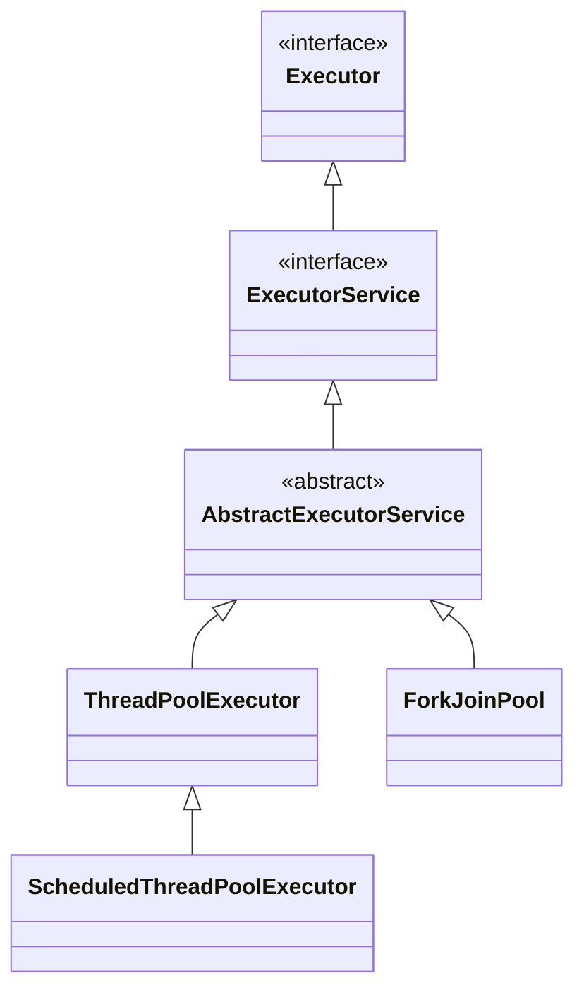

It provides a pool of threads and an API for assigning tasks to it.

- It is an interface present in the package `java.util.concurrent`
- Below are implementations of `ExecutorService`:
	- ForkJoinPool
	- ThreadPoolExecutor
	- ScheduledThreadPoolExecutor





There are several factory methods defined in the `Executors` class to create a predefined `ExecutorService`. The easiest way to create `ExecutorService` is to use below factory method of the `Executors` class.

```java
ExecutorService executor = Executors.newFixedThreadPool(10);
```

