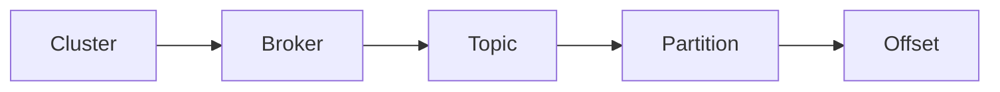

# Features of Kafka

- **Kafka is highly scalable**. It is very easy to add large number of consumers without affecting performance or reliability. That’s because Kafka does not track which messages in the topic have been consumed by consumers. It simply keeps all messages in the topic within a configurable period. Kafka is linearly scalable for high volume of data. Adding more brokers / clusters will increase the throughput or decrease latency.

- **Message durability is high in Kafka.** It persists the messages/events for the specified time period.

- **Kafka handles spike of the events more efficiently**. This is where Kafka truly shines because it acts as a “**_shock absorber_**” between the producers and consumers.

- **Kafka also supports different consumption models**. You can have one consumer processing the messages **at real-time** and another consumer processing the messages in **batch mode** in a totally decoupled fashion.

- **Kafka supports the ability to source messages from a wide range of producers.**

- **Kafka supports excellent integration with other processing frameworks.** These include as _Apache Storm, Spark, NiFi, Flume_ etc. to complete the job.

- **Broker:** The server (physical or virtual) that holds the queue.
- **Topic:** A stream of messages belonging to a particular category is called a topic. Data is stored in topics.
- **Partition:** Topics are split into partitions. For each topic, Kafka keeps a minimum of one partition. Each such partition contains messages in an immutable ordered sequence. A partition is implemented as a set of segment files of equal sizes.
- **Partition offset:** Each partitioned message has a unique sequence id called as offset.

# Partitions

In the last part we had a brief introduction of topics that they’re addressable abstraction used to demonstrate interest in a specific data stream (series of records/messages) and that it consists of some number of partitions which are a series of order queues.

Topic with 3 partitions

## Why do we need partitions?

We have previously created a topic with only a single partition and it served our purpose. Then the question arises : why are partitions even needed?

You must partition your data if you have so much traffic that more than one instance of your application is required. For the downstream application, your partitioning strategy acts as load balancing. The producer clients determine which topic partition the data is placed in, while the decision logic is driven by the consumer apps’ actions with the data.

We also get the following benefits with partitioning:

- Multiple consumers can consume a single topic at the same time. The number of consumers that a single broker can sustain is limited because it serves all partitions. Multiple brokers’ partitions allow for more consumers.
- Multiple instances of the same consumer can connect to separate brokers’ partitions, allowing for extremely high message throughput. One partition will serve each consumer instance, ensuring that each record has a clear processing owner.
- Across several brokers, Kafka retains multiple copies of the same partition. A replica is the term for this duplicate copy. If a broker fails, Kafka can still provide consumers with copies of the partitions that the failed broker was responsible for.

## Writing to partitions

Be default, Kafka will assign partitions in a round-robin fashion. Those records will be evenly distributed across all partitions of a given topic.  
However, if no partition key is provided, the ordering of records within a partition cannot be ensured.

As a result, utilizing a partition key to group related events in the same partition in the order they were sent appears to be a better alternative.

A partition key allows a producer to direct messages to a certain partition. Any value that may be obtained from the application context can be used as a partition key. A suitable partition key is a unique device ID or a user ID.  
The partition key is passed via a hashing function by default, and the partition assignment is created. As a result, all recordings made with the same key will arrive in the same partition.

If the keys aren’t evenly distributed, key-based partitioning can result in broker imbalance. That means one of the partitions will have a lot more values than the other if its key is getting almost all the traffic. This is why ensuring that the keys are evenly distributed is highly advised.

In some cases, producer can write their own partitioning implementation based on any business logic to direct the messages accordingly to the right partition.

# Consumer Group

A consumer group is a collection of consumers who work together to consume data on a specific topic. All of the topics’ partitions are divided among the group’s consumers.

Kafka’s consumer groups allow it to take advantage of both message queuing and publish-subscribe architectures. A group id is shared by Kafka consumers who belong to the same consumer group. The consumers in a group then distribute the topic partitions as evenly as feasible amongst themselves by ensuring that each partition is consumed by just one consumer from the group.

Different consumers consuming partitions exclusively in a consumer group

A message is only ever read by one customer in a consumer group, owing to the consumer group idea.  
When a consumer group consumes a topic’s partitions, Kafka ensures that each partition is consumed by exactly one consumer.

## How it satisfies both messaging models

If all consumers are from the same group, the Kafka model functions as a traditional message queue would. All the records and processing is then load balanced Each message would be consumed by one consumer of the group only. Each partition is connected to at most one consumer from a group.

When multiple consumer groups exist, the flow of the data consumption model aligns with the traditional publish-subscribe model. The messages are broadcast to all consumer groups.

