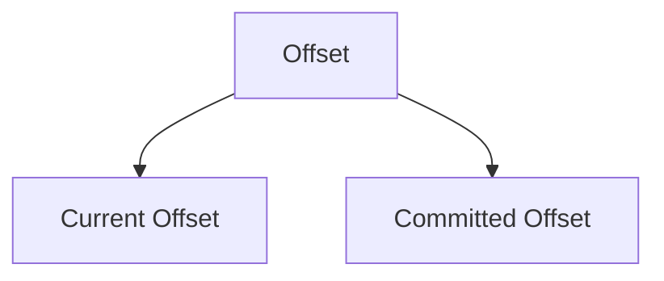
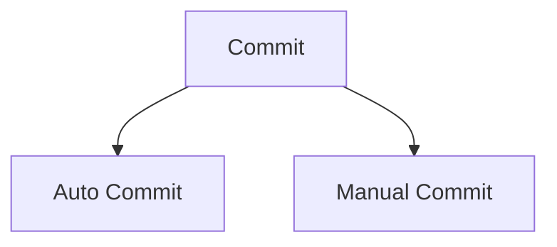

A Kafka topic receives messages across a distributed set of partitions where they are stored. Each partition maintains the received messages in a sequential order where they are identified by an offset, also known as a position.

> The ___offset___ is a type of metadata in Kafka that represents the position of a message in a certain partition. Each message in a partition has its own unique offset value, which is represented by an integer.

The offset of a message acts as a consumer-side cursor. By keeping track of the offset of messages, the consumer keeps track of which messages it has already consumed. The consumer advances its cursor to the next offset in the partition and continues after reading a message. The consumer is responsible for advancing and remembering the latest read offset within a partition.
# Offset Types

Kafka maintains two types of offsets:
- Current offset
- Committed offset



## Current Offset

The current offset is a pointer to the last record that Kafka has already sent to a consumer in the most recent poll, so that the consumer doesn’t receive the same record twice.
## Committed Offset

The committed offset is a pointer to the last record that a consumer has successfully processed. We work with the committed offset in case of any failure in application or replaying from a certain point in an event stream. When it comes to partition rebalancing, the committed offset is crucial.

# Offset Storage

- Kafka stores offsets in an internal topic named `__consumer_offsets` by default.
- This topic is partitioned and replicated, ensuring fault tolerance and scalability.
- Each record in this topic represents a mapping of a consumer group, topic, and partition to the last committed offset. The offset data in the `__consumer_offsets` topic includes:
    1. **Consumer Group ID:** Identifies the consumer group to which the offset belongs.
    2. **Topic Name:** The topic associated with the offset.
    3. **Partition Number:** The partition within the topic.
    4. **Committed Offset:** The last processed message position.
    5. **Metadata:** Optional metadata, such as information about the consumer or custom application data.

>[! note]
>For specific use cases, applications can choose to store offsets in an external storage system, such as HBase, Kafka, HDFS, ZooKeeper, a database or a distributed cache, for greater control or integration with other systems.
>

# Committing an offset

When a consumer in a group receives messages from the partitions assigned by the coordinator, it must commit the offsets corresponding to the messages processed. If a consumer crashes or shuts down, its partitions will be reassigned to another member, who will start consuming partitions from the previous committed offset. If the consumer fails before the offset is committed, then the consumer which takes over its partitions will use the reset `auto.offset.reset` policy.

`auto.offset.reset` determines where consumers start reading when they have no committed offset or when their offset is invalid. It has three possible values:
- `earliest` - Start from the beginning of the partition
- `latest` - Start from the newest messages (default)
- `none` - Throw an exception if no offset is found

>[!note]
>Offsets in Kafka's `__consumer_offsets` topic can expire based on the `offsets.retention.minutes` setting (default 7 days). After expiration, older offset records are deleted during log compaction. When a consumer group becomes inactive for longer than this retention period and tries to resume, it will find no valid offset and will use the `auto.offset.reset` policy.

There are two ways to commit an offset:
- Auto Commit
- Manual Commit


## Auto Commit

By default, the consumer is configured to use an automatic commit policy, which triggers a commit on a periodic interval. This feature is controlled by setting two properties:

```conf
enable.auto.commit=true
auto.commit.interval.ms=5000
```

Although auto-commit is a simple feature, it may result in duplicate message processing if a failure occurs before the next commit.

>[!example]
>You’ve got some messages in the partition, and you’ve requested your first poll. Because you received ten messages, the consumer raises the current offset to ten. You process these ten messages and initiate a new call in four seconds. Since five seconds have not passed yet, the consumer will not commit the offset. Then again, you’ve got a new batch of records, and rebalancing has been triggered for some reason. The first ten records have already been processed, but nothing has yet been committed. Right? The rebalancing process has begun. As a result, the partition is assigned to a different consumer. Because we don’t have a committed offset, the new partition owner should begin reading from the beginning and process the first ten entries all over again.
>
>A manual commit is the solution to this particular situation. As a result, we may turn off auto-commit and manually commit the records after processing them.

## Manual Commit

Manual Commits provides fine-grained control over when offsets are committed, ensuring accurate tracking of processed messages. You can enable manual commit by setting below configuration.

```conf
enable.auto.commit=false
```

Manual committing is useful in case you want to replay and process records from a certain point in the past. For that to work, you actually commit an old offset over a recent one.

There are two ways to implement manual commits:
### Commit Sync `commitSync()`

The synchronous commit method is simple and dependable, but it is a blocking mechanism. It will pause your call while it completes a commit process, and if there are any recoverable mistakes, it will retry. Kafka Consumer API provides this as a prebuilt method [here](https://kafka.apache.org/25/javadoc/org/apache/kafka/clients/consumer/KafkaConsumer.html#commitSync--).

### Commit Async `commitAsync()`

If you use asynchronous commit method, the commit request will be sent and the process will continue to poll next batch of messages without getting blocked. This way of committing is also provided by the Kafka Consumer API [here](https://kafka.apache.org/25/javadoc/org/apache/kafka/clients/consumer/KafkaConsumer.html#commitAsync--). The disadvantage is that commitAsync does not attempt to retry. However, there is a legitimate justification for such behavior.

>[!example]
>Assume you’re attempting to commit an offset as 70. It failed for whatever reason that can be fixed, and you wish to try again in a few seconds. Because this was an asynchronous request, you launched another commit without realizing your prior commit was still waiting. It’s time to commit 100 this time. Commit 100 is successful, however commit 75 is awaiting a retry. Now how would we handle this? Since you don’t want an older offset to be committed.
>
>This could cause issues. As a result, they created asynchronous commit to avoid retrying. This behavior, however, is unproblematic since you know that if one commit fails for a reason that can be recovered, the following higher level commit will succeed.

# Offset Management Process

1. **Consuming Messages:**
   - When a consumer reads a message from a partition, it receives the offset of that message.
   - The consumer processes the message and decides when to commit the offset.

2. **Committing Offsets:**
   - **Automatic Commit:** If enabled, the consumer periodically commits the latest processed offset.
   - **Manual Commit:** The consumer can commit the offset after processing the message to ensure that it doesn't lose track of its progress in case of a failure.

3. **Storing Offsets in `__consumer_offsets`:**
   - The offset commit request is sent to the Kafka broker, which stores it in the `__consumer_offsets` topic.
   - The offsets are stored as key-value pairs where the key is a combination of the consumer group, topic, and partition, and the value is the offset.

4. **Fetching Offsets:**
   - When a consumer restarts or is assigned a partition, it fetches the last committed offset from the `__consumer_offsets` topic to resume consuming from the correct position.

# Benefits of Offset Management

- **Fault Tolerance:**
	Since offsets are stored in Kafka itself, they are replicated and persisted, providing fault tolerance.
- **Scalability:**
	The `__consumer_offsets` topic is partitioned, allowing it to scale with the number of consumer groups and partitions.
- **Flexibility:**
	Consumers can choose between automatic and manual offset management, providing flexibility in handling offsets according to application requirements.
