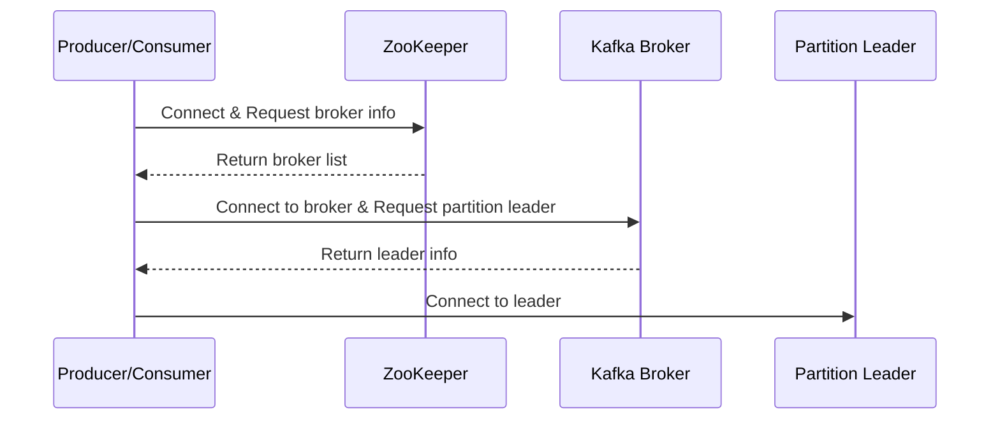

As we know, Kafka brokers are stateless; they rely on ZooKeeper to maintain and coordinate brokers, such as notifying consumers and producers of the arrival of a new broker or failure of an existing broker, as well as routing all requests to partition leaders.

Zookeeper is used for storing all sorts of metadata about the Kafka cluster:
- It maintains the last offset position of each consumer group per partitions, so that consumers can quickly recover from the last position in case of a failure (although modern clients store offsets in a separate Kafka topic).
- It tracks the topics, number of partitions assigned to those topics, and leaders / followers locations of each partition.
- It also manages the access control lists (ACLs) to different topics in the cluster. ACLs are used to enforce access or authorization.

# Evolution of ZooKeeper

## ZooKeeper’s Role in Pre-0.9.0.0 Kafka

Before version 0.9.0.0, Kafka relied on ZooKeeper for storing and managing critical metadata, including:
1. **Topic Information**: Details like the number of partitions, replication factors, and more.
2. **Broker Information**: Information about Kafka brokers, including IP addresses and port numbers.
3. **Consumer Group Information**: Information about which consumers are subscribed to specific topics.
4. Additionally, ZooKeeper was instrumental in coordinating the election of a controller broker, responsible for cluster management and partition rebalancing.

## The Pre-0.9.0.0 Kafka Communication Process

In the older versions of Kafka, all clients (i.e., producers and consumers) used to directly talk to ZooKeeper to find the partition leader.

![[Excalidraw/Kafka/images/zookeeper_role_kakfa.svg]]

In earlier Kafka versions, the **old Kafka protocol** was designed for communication between ZooKeeper and Kafka brokers. It was **not designed for direct communication** between producers and consumers and Kafka brokers. Producers and consumers communicated through ZooKeeper as follows:

1. Producers connected to ZooKeeper to discover brokers in the cluster before sending messages.
2. Once the producer had the latest cluster metadata, it could start sending messages to brokers. However, the producer still needed to go through ZooKeeper to coordinate the election of a controller broker and to ensure that all of the producers had the same view of the cluster state.
3. Consumers also connected to ZooKeeper to identify brokers and gather information about topics they subscribed to before polling brokers for messages.

### Drawbacks

1. **Complexity**: Producers and consumers had to understand and interact with ZooKeeper multiple times.
2. **Performance**: Communication had to pass through ZooKeeper, which could impact performance.
3. **Scalability**: ZooKeeper presented a single point of failure.

## The Post-0.9.0.0 Kafka Communication Process

With the release of Kafka 0.9.0.0, a significant shift occurred. While ZooKeeper continued to manage metadata, ZooKeeper was no longer required for producers and consumers to communicate with Kafka brokers directly.

This change was enabled by the introduction of a new Kafka protocol, ___a binary protocol___ for direct communication between brokers, producers, and consumers. In previous versions, producers and consumers needed to interact with Kafka brokers via ZooKeeper.

Kafka 0.9.0.0 and later versions introduced a streamlined communication process:
1. Producers connected directly to brokers to send messages.
2. Consumers also connected directly to brokers to subscribe to topics.
3. Brokers then transmitted messages from subscribed topics to consumers.

### Advantages

The new Kafka protocol brought several benefits:
1. **Simplicity**: Producers and consumers no longer need to be aware of ZooKeeper.
2. **Performance**: Direct communication between brokers, producers, and consumers improved efficiency.
3. **Scalability**: The removal of ZooKeeper as a single point of failure enhanced scalability.

## ZooKeeper’s Ongoing Role in Kafka

Despite these changes, ZooKeeper remains a vital part of Kafka. It’s recommended to run ZooKeeper alongside Kafka in production environments because it provides:
1. **Fault Tolerance:** ZooKeeper is highly available and can tolerate node failures.
2. **Consistency**: It offers a consistent view of the cluster to all clients.
3. **Coordination**: ZooKeeper facilitates coordination among distributed applications, including Kafka.

### Functionalities of ZooKeeper in Kafka 0.9.0.0:

1. Registering new brokers in the cluster.
2. Registering new topics created by producers.
3. Watching for changes in topic metadata by consumers.
4. Handling broker failures and triggering partition rebalancing.
5. Supporting the controller broker’s cluster state tracking.

# Kafka Raft Metadata Mode

KRaft mode is the next-generation Kafka protocol that simplifies cluster management and enhances performance. It is set to replace ZooKeeper in the future.

In KRaft mode, a single Kafka broker can handle both metadata and client requests in a local development environment.

Beginning with Kafka version 2.8.0, Apache Kafka introduced Kafka Raft metadata mode as an alternative to ZooKeeper. Kafka Raft metadata mode eliminates the need for a separate ZooKeeper cluster and offers advantages like reduced complexity, improved performance, and simplified operations.

Kafka’s internal Raft quorum is a distributed consensus algorithm that is used to store and manage metadata. The Raft quorum consists of a set of brokers, and each broker maintains a copy of the metadata.

The Raft quorum works by electing a leader broker. The leader broker is responsible for replicating the metadata to all of the other brokers. When the leader broker receives a request to change the metadata, it appends the change to its log and then replicates the log to the other brokers. Once a majority of the brokers have acknowledged the change, the leader broker commits the change to the metadata.

If the leader broker fails, one among the standby controller brokers becomes the active controller. The new leader broker will then synchronize its copy of the metadata with the other brokers.

The below table compares the pros and cons of using ZooKeeper in older Kafka versions versus the benefits of Kafka Raft metadata mode in newer versions: