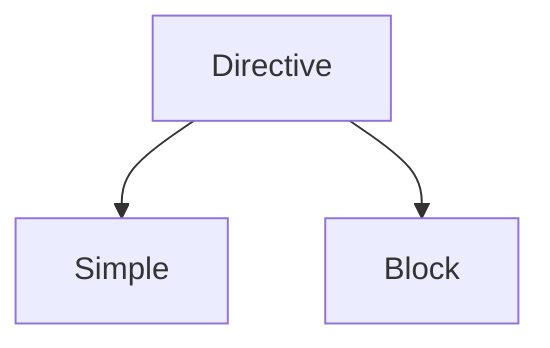

NGINX uses a text‑based configuration file written in a particular format. By default the file is named **nginx.conf** and can be located in one of:

```bash
/etc/nginx/
/usr/local/etc/nginx
/usr/local/nginx/conf
```


## Feature-Specific Configuration Files

To make the configuration easier to maintain, we recommend that you split it into a set of feature‑specific files stored in the **/etc/nginx/conf.d** directory and use the `include` directive in the main **nginx.conf** file to reference the contents of the feature‑specific files.

```nginx
include conf.d/http;
include conf.d/stream;
include conf.d/exchange-enhanced;
```

## Contexts

A few top‑level directives, referred to as _contexts_, group together the directives that apply to different traffic types:

- `events` – General connection processing
- `http` – HTTP traffic
- `mail` – Mail traffic
- `stream` – TCP and UDP traffic

Directives placed outside of these contexts are said to be in the `main` context. The following configuration illustrates the use of contexts.

```nginx
user nobody; # a directive in the 'main' context

events {
    # configuration of connection processing
}

http {
    # Configuration specific to HTTP and affecting all virtual servers  

    server {
        # configuration of HTTP virtual server 1       
        location /one {
            # configuration for processing URIs starting with '/one'
        }
        location /two {
            # configuration for processing URIs starting with '/two'
        }
    } 
    
    server {
        # configuration of HTTP virtual server 2
    }
}

stream {
    # Configuration specific to TCP/UDP and affecting all virtual servers
    server {
        # configuration of TCP virtual server 1 
    }
}
```

# NGINX Directives

Directives are divided into two parts:


- **Simple Directive:**
	A simple directive consists of the name and parameters separated by spaces and ends with a semicolon (**;**).
	- [[NGINX Configuration Files#`listen`|listen]]
	- [[NGINX Configuration Files#`server_name`|server_name]]

- **Block Directive:**
	A block directive has the same structure as a simple directive, but instead of the semicolon it ends with a set of additional instructions surrounded by braces (`{` and `}`). It acts as “container” that groups together related directives.
	- [[NGINX Configuration Files#`location`|location]]
	A block directive can have other directives inside braces, it is called a context.
	- [[NGINX Configuration Files#`server`|server]]


Directives placed in the configuration file outside of any contexts are considered to be in the `main` context. The `events` and `http` directives reside in the `main` context, `server` in `http`, and `location` in `server`.

# Module: ngx_http_core_module

## `server`

Server block sets configuration for a virtual server. There is no clear separation between IP-based (based on the IP address) and name-based (based on the ***Host*** request header field) virtual servers. Instead, the [[NGINX Configuration Files#`listen`|listen]] directives describe all addresses and ports that should accept connections for the server, and the [[NGINX Configuration Files#`server_name`|server_name]] directive lists all server names.

## `listen`

| Context | Default |
| --------- | --------- |
| server | listen \*:80 \| \*:8000 ;|

Sets the `address` and `port` for IP, or the `path` for a UNIX-domain socket on which the server will accept connection requests.

```nginx
# Both address and port, or only address or only port can be specified:

listen 127.0.0.1:8000;
listen 127.0.0.1;
listen 8000;
listen *:8000;
listen localhost:8000;

# IPv6 addresses are specified in square brackets:

listen [::]:8000;
listen [::1];

# UNIX-domain sockets (0.8.21) are specified with the “unix:” prefix:

listen unix:/var/run/nginx.sock;
```

>[!note]
>- If only address is given, then port `80` is used by default.
>- If only port is given, then IP address `0.0.0.0` is used by default
>- If `listen` directive is not present then either `*:80` is used if nginx runs with the superuser privileges, or `*:8000` otherwise.


### `- default_server`

The `default_server` parameter will cause the `server` block to become the default `server` block for the specified `address:port` pair. It will be used when NGINX cannot determined a specific `server` block out of multiple matching `server` blocks for a given request.

If none of the `listen` directives of `server` blocks have the `default_server` parameter then the first `server` block with the `address:port` pair will be the default server for this pair.

>[!note]
>There can be only one `default_server` declaration for each `address:port` pair.


## `server_name`

| Context | Default |
| --------- | --------- |
| server | server_name "" ;|

Server names are defined using the `server_name` directive and determine which `server` block is used for a given request based on the ***Host*** request header field. Server names may be defined as:

- ###### Exact names

- ###### Wildcard names
	A wildcard name may contain an asterisk only on the name’s start or end, and only on a dot border.

- ###### Regular expression names
	The regular expressions used by NGINX are compatible with those used by the Perl programming language (PCRE). To use a regular expression, the server name must start with the tilde character(~), otherwise it will be treated as an exact name, or if the expression contains an asterisk, as a wildcard name (and most likely as an invalid one).

- ###### Empty name
	If it is required to process requests without the ***Host*** header field in a server block which is not the default, an empty name should be specified. Also, If no `server_name` is defined in a server block then NGINX uses the empty name as the server name.

- ###### IP address
	If someone makes a request using an IP address instead of a server name, the “Host” request header field will contain the IP address and the request can be handled using the IP address as the server name


```nginx
# Exact names
server {
    listen 80;
    server_name  example.org  www.example.org;
    ...
}

# Wildcard names
server {
    listen 80;
    server_name  *.example.org .example.org;
    ...
}

# Regular expression names
server {
    listen 80;
    server_name  ~^(?<user>.+)\.example\.net$;
    ...
}

# Empty name
server {
    listen 80;
    server_name  example.org  www.example.org  "";
    ...
}

# IP address
server {
    listen 80;
    server_name  example.org
				www.example.org
				""
				192.168.1.1;
    ...
}

```


### - Server Name Hash Tables

Exact names, wildcard names starting with an asterisk, and wildcard names ending with an asterisk are stored in three hash tables bound to the listen ports.

The exact names hash table is searched first. If a name is not found, the hash table with wildcard names starting with an asterisk is searched. If the name is not found there, the hash table with wildcard names ending with an asterisk is searched.

Searching wildcard names hash table is slower than searching exact names hash table because names are searched by domain parts.

Regular expressions are tested sequentially and therefore are the slowest method and are non-scalable. 

For these reasons, it is better to use exact names where possible.

>[!note]
>If a server is the only server for a listen port, then NGINX will not build the hash tables for the listen port to test server names at all.


## `location`

| Context | Syntax |
| --------- | --------- |
| server, location | **location** [ \= \| \~ \| \~\* \| \^\~ ] `uri` { ... }
||**location** **\@name** { ... }|

Sets configuration depending on a request URI.

A location can either be defined by:
- **An Exact Match:**  `location = uri { ... }`
	If an exact match is found, the search terminates. For example, if a “`/`” request happens frequently, defining “`location = /`” will speed up the processing of these requests, as search terminates right after the first comparison.

- **A Prefix String:** `location [^~] uri { ... }`
	If the longest matching prefix location has the “`^~`” modifier then regular expressions are not checked.

- **A Regular Expression:** `location  ~ | ~* uri { ... }` 
	Regular expressions are specified with:
	- the “`~`” modifier (for case-sensitive matching)
	- the preceding “`~*`” modifier (for case-insensitive matching)

>[!note]
>`location` blocks can be nested, with some exceptions like a named location which is defined by `@`

### - How NGINX finds a location matching a given request

NGINX first checks locations defined using the prefix strings (prefix locations). Among them, the location with the longest matching prefix is selected and remembered. Then regular expressions are checked, in the order of their appearance in the configuration file. The search of regular expressions terminates on the first match, and the corresponding configuration is used. If no match with a regular expression is found then the configuration of the prefix location remembered earlier is used.

Let’s illustrate the above by an example:

```nginx
location = / {
    [ configuration A ]
}

location / {
    [ configuration B ]
}

location /documents/ {
    [ configuration C ]
}

location ^~ /images/ {
    [ configuration D ]
}

location ~* \.(gif|jpg|jpeg)$ {
    [ configuration E ]
}
```

* The “`/`” request will match configuration A
*  The “`/index.html`” request will match configuration B
*  The “`/documents/document.html`” request will match configuration C
*  The “`/images/1.gif`” request will match configuration D
*  The “`/documents/1.jpg`” request will match configuration E

## Serving Static Content

An important web server task is serving out files (such as images or static HTML pages). Depending on the request, files will be served from different local directories:
- `/data/www` (containing HTML files)
	- Create the `/data/www` directory and put an `index.html` file
- `/data/images` (containing images)
	- Create the `/data/images` directory and place some images in it

```nginx
http {
    server {
	    location / {
	        root /data/www;
	    }
	
	    location /images/ {
	        root /data;
	    }
    }
}
```


```nginx
http {
	upstream myproject {
		server 127.0.0.1:8080 weight=3;
		server 127.0.0.1:8081;
		server 127.0.0.1:8082;
		server 127.0.0.1:8083;
	}

	server {
		listen 80;
		server_name www.domain.com;
		location / {
			proxy_pass http://myproject;
		}
	}
}
```


# Module: ngx_http_rewrite_module

## `rewrite`

| Context | Syntax |
| --------- | --------- |
| server, location, if | **rewrite** `regex` `replacement` [_flag_]; |

If the specified regular expression matches a request URI, URI is changed as specified in the `replacement` string.

An optional `flag` parameter can be one of:
- `last`:
	Stops processing the current set of `ngx_http_rewrite_module` directives and starts a search for a new location matching the changed URI
- `break`: 
	Stops processing the current set of `ngx_http_rewrite_module` directives as with the break directive
- `redirect`:
	Returns a temporary redirect with the ==302== code; used if a replacement string does not start with “`http://`”, “`https://`”, or “`$scheme`”
- `permanent`:
	Returns a permanent redirect with the ==301== code

