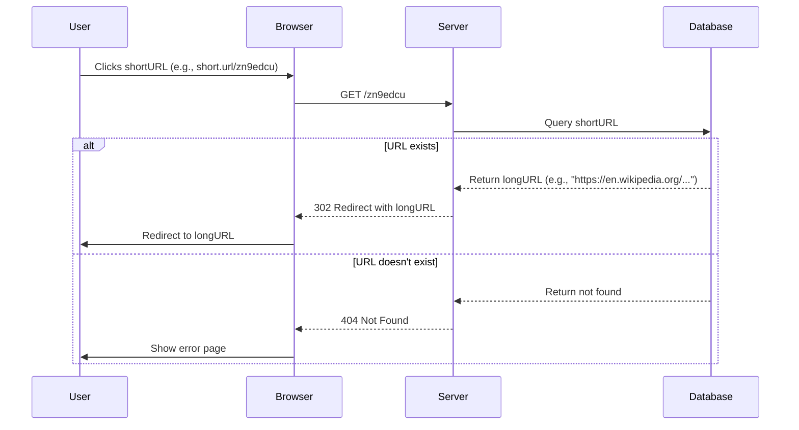
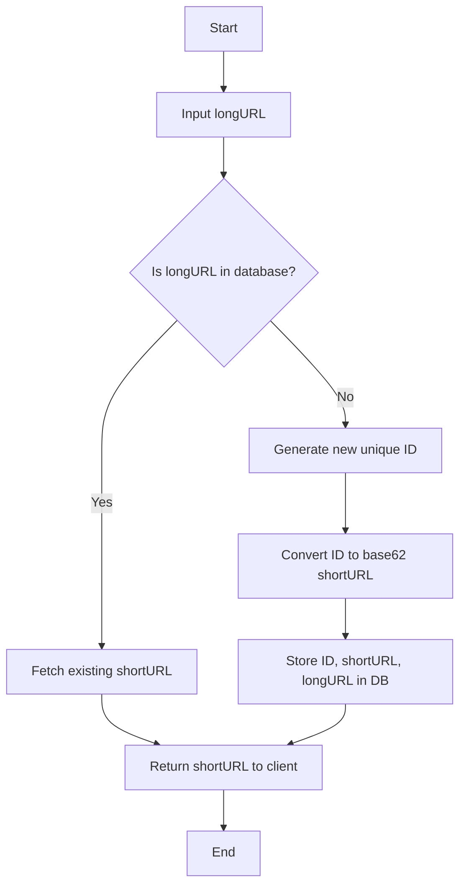

>[!question]
>	Design a URL shortening service like Bitly or TinyURL.
# Functional Requirements

1. **Shorten a URL** – Given a long URL, return a short, unique URL.
2. **Redirect** – When a user accesses a short URL, redirect them to the original long URL.
3. **Analytics** (Optional) – Track the number of clicks, geolocation, referrers, etc.
4. **Expiration** (Optional) – Allow users to set an expiration date for short links.

# Non-Functional Requirements

1. **High Availability** – The service should be highly available since URL redirection is a critical feature.
2. **Low Latency** – Redirection should be fast (< 100ms) and should not degrade at any point of time (Even during peak loads).
3. **Scalability** – The system should support billions of requests per day.
4. **Consistency vs. Availability** – We prioritize availability over strong consistency (AP in CAP theorem).
5. **Security** – URL should not be predictable. Prevent abuse, phishing, and spam.

# Back-of-the-Envelope (BOE) Estimation

## Traffic Estimation

- Assuming _200:1 read/write_ ratio
- Number of unique shortened links generated per month = 100 million
- Number of unique shortened links generated per seconds = 100 million /(30 days * 24 hours * 3600 seconds ) ~ **40 URLs/second**
- With 200:1 read/write ratio, number of redirections = 40 URLs/s * 200 = **8000 URLs/s**

## Storage Estimation

- Assuming lifetime of service to be 100 years and with 100 million shortened links creation per month, total number of data points/objects in system will be = 100 million/month * 100 (years) * 12 (months) = 120 billion
- Assuming size of each data object (_Short url, long url, created date_ etc.) to be 500 bytes long, then total require storage = 120 billion * 500 bytes =**60TB**

## Memory Estimation

- Following Pareto Principle, better known as the 80:20 rule for caching. (80% requests are for 20% data)
- Since we get 8000 read/redirection requests per second, we will be getting 700 million requests per day: 8000/s * 86400 seconds =**~700 million**
- To cache 20% of these requests, we will need ~70GB of memory.
	0.2 * 700 million * 500 bytes = **~70GB**


# High Level Design

At a high level, the system consists of the following components:

1. **API Layer**: Handles requests for URL shortening and redirection.
2. **Database (Storage Layer)**: Stores mappings between short and long URLs.
3. **Cache Layer**: Reduces DB load and speeds up redirection.
4. **Load Balancer**: Distributes traffic across API servers.
5. **Analytics System**: Tracks URL usage stats (optional).


![[Excalidraw/System Design/images/url_shortener.svg]]

# REST APIs

- Create Short Url
- Delete Url
- User Signup, Login, Logout
- Redirect URL

> [!note]
> HTTP **302** Redirect status is sent back to the browser instead of HTTP **301** Redirect. A **301** redirect means that the page has permanently moved to a new location. A **302** redirect means that the move is only temporary. Thus, returning **302** redirect will ensure all requests for redirection reaches to our backend and we can perform analytics (Which is a functional requirement)

# Database Schema

A simple relational DB schema might look like:

```
URLTable
---------------------------------------
| short_url  | long_url  | user_id | created_at | expires_at |
---------------------------------------
| abc123     | https://longurl.com | 12345 | 2025-03-30  | NULL |
```

• **Primary Key:** short_url
• **Indexes:** short_url (for fast lookups), user_id (for analytics)

>[!note]
>For scalability, we can explore **NoSQL (e.g., DynamoDB, Cassandra, Redis)** with key-value storage:
  
# API Design


```
POST /shorten
Body: { "long_url": "https://example.com" }
Response: { "short_url": "https://short.ly/abc123" }

GET /abc123
Response: 301 Redirect to "https://example.com"
```
  
# URL Redirection

- A user enters a **short URL** like: `https://short.ly/XyZ123`.
- The backend extracts the short **ID (XyZ123)** and **decodes it back** to the original numeric ID (if Base62 was used).
- The service **queries the database** (or cache) to find the corresponding long URL.

```sql
-- "XyZ123" → 1234567 (numeric ID).
SELECT long_url FROM urls WHERE id = 1234567;
-- OR
SELECT long_url FROM urls WHERE short_code = 'XyZ123';
```

- If the URL is found, return an **HTTP 301 (Permanent) or 302 (Temporary) redirect** to send the user to the original destination.

```http
HTTP/1.1 301 Moved Permanently
Location: https://www.example.com/some/long/path
```



## HTTP Status code
 
 **301 redirect:** A 301 redirect shows that the requested URL is _permanently_ moved to the long URL. Since it is permanently redirected, the browser caches the response, and subsequent requests for the same URL will not be sent to the URL shortening service. Instead, requests are redirected to the long URL server directly.

**302 redirect:** A 302 redirect means that the URL is _temporarily_ moved to the long URL, meaning that subsequent requests for the same will be sent to the URL shortening service first. Then, they are redirected to the long URL server.

Each redirection method has its pros and cons. If the priority is to reduce the server load, using 301 redirect makes sense as only the first request of the same URL is sent to URL shortening servers. However, if analytics is important, 302 redirect is a better choice as it can track click rate and source of the click more easily.

# Short URL Generation

Let us assume the short URL looks like this: `www.tinyurl.com/{hashValue}`. To support the URL shortening use case, the hash function must satisfy the following requirements:
- Each _longUrl_ must be hashed to one _hashValue_.
- Each _hashValue_ can be mapped back to the _longUrl_.

## Hash value length

The goal is to determine the required hash length when the hash contains characters from [0-9, a-z, A-Z] (Base62) and the system must support upto **120 billion** URLs based on the back of the envelope estimation.

Base62 encoding uses the following characters:

```
0-9 (10) + a-z (26) + A-Z (26) = 62 characters
```

Each character in the hash can have **62** possible values. The total number of unique hashes should be at least **120 billion**:

$N = 120 \times 10^9$

- We need to determine the **smallest length L** such that:
	
	$62^L \geq 120 \times 10^9$
	
- Taking the **logarithm on both sides**:
	
	$L \geq \frac{\log(120 \times 10^9)}{\log(62)}$

- Approximating values:

	$\log_{10}(120 \times 10^9) \approx \log_{10}(1.2 \times 10^{11})$
		$= \log_{10}(1.2) + \log_{10}(10^{11})$
		$= 0.08 + 11 = 11.08$

	$\log_{10}(62) \approx 1.79$

  
Now calculating: $L \geq \frac{11.08}{1.79} \approx 6.2$. Since L must be an **integer**, we round **up** to L = 7.

If $L = 7$, the total number of unique hashes: $62^7 = 3.5 \times 10^{12} = 3.5 trillion$ which is **much more than 120 billion**, providing a good buffer.

If L = 6: $62^6 = 56.8 \times 10^9 = 56.8 billion$ which is **too small** to store 120 billion URLs.

Thus, **7 characters are required** for guaranteed uniqueness.

## Approach 1: Hash Functions

A straightforward solution is to use well-known hash functions like CRC32, MD5, SHA-1 or SHA-256. Let’s take an example URL: `https://example.com/some-long-url`

We will compute its hash values using **CRC32, MD5, SHA-1, and SHA-256**.

| **Hash Function** | **Hash Value (Hexadecimal)**                                         | **Hash Length (Bits)** |
| ----------------- | -------------------------------------------------------------------- | ---------------------- |
| **CRC32**         | 5A0B8C3F                                                             | 32 bits (4 bytes)      |
| **MD5**           | 56e1dfffc1d5566b6f8599e2a0a80372                                     | 128 bits (16 bytes)    |
| **SHA-1**         | 994d38563a3f5b8e4b38df3e91842d07be3fbb7b                             | 160 bits (20 bytes)    |
| **SHA-256**       | e7ef4b80e60274d8db3a8bb07171b3662cba3dcdb<br>b66eb36899dc3cf52dc28f3 | 256 bits (32 bytes)    |

- **If we directly use a hash as a short URL**, we must **truncate** it and take the first 7 characters.
- **Truncation increases collision risk** since a hash function generates a longer output than needed for URL shortening.

A **collision** occurs when two different inputs produce the same hash output. This happens due to the **pigeonhole principle**, which states:

> If you have more possible inputs than outputs, some inputs must map to the same output.  

Here’s why collisions can happen for different hash functions:

**1. CRC32 (High Collision Risk)**

- Only **32-bit hash space** → **Very limited** (only 4.3 billion unique values).
- High chance of **collisions** when billions of URLs are stored.

**2. MD5 (Moderate Collision Risk)**

- **128-bit hash space** (~10^{38} values), but **MD5 is broken**.
- **Deliberate collisions** can be generated via cryptanalysis.

**3. SHA-1 (Moderate Collision Risk)**

- **160-bit hash space** (~10^{48}).
- **Not collision-resistant** anymore (Google’s “SHAttered” attack).

**4. SHA-256 (Low Collision Risk)**

- **256-bit hash space** (~10^{77}), making **collisions nearly impossible**.
- However, hashing is deterministic, so shortening to 7 chars will create collisions.

>[!A better approach]
>	Use Base62 encoding of an incremental ID instead of hashing.


## Approach 2: Base62 Encoding

Base62 encoding is a common approach for generating short, human-readable, and URL-friendly unique identifiers. Instead of hashing the input URL, **we encode a unique ID (typically an auto-incremented integer) into a Base62 string**.

Base62 consists of **62 unique characters**:

- **Digits:** 0-9 (10 characters)
- **Lowercase letters:** a-z (26 characters)
- **Uppercase letters:** A-Z (26 characters)

```
0-9 (10) + a-z (26) + A-Z (26) = 62 characters
```

- Use an **incrementing counter (auto increment ID)** and convert it into Base62.
- Short URL length is not fixed. It goes up with ID.
- Base62 uses characters [A-Za-z0-9], allowing **62^7 combinations (~350T URLs)**.

### **Advantages of Base62 Encoding**

✅ **Short & Human-Friendly** – Base62-encoded strings are shorter than hexadecimal or Base64, making them ideal for URLs.
✅ **Collision-Free** – Since we **encode unique auto-incrementing IDs**, no two URLs will have the same short code.
✅ **Efficient Lookups** – The encoded value maps directly to a **numeric primary key** in the database, ensuring **O(1) lookups**.
✅ **URL-Safe** – Unlike Base64 (+/ characters can cause URL issues), Base62 uses **only alphanumeric characters**.

To achieve **fixed-length Base62 encoding**, use one of these approaches:
1. **Predefine an ID range (e.g., start IDs at** 62^6 **for 7-char Base62).**
2. **Left-pad shorter encoded strings with ‘0’ to a fixed length.**
3. **Always encode a fixed-bit integer (e.g., 42-bit ID ensures 7-char Base62).**


**Cons:** It is easy to figure out what is the next available short URL if ID is incremented by 1 for a new entry. This can be a security concern.




For efficient ID generation for large-scale URL shorteners, you can refer here: [[Unique ID Generator#**Efficient ID Generation for Large-Scale URL Shorteners**|link]]


# Read Optimization (Caching)

In a URL shortening service, **read operations (redirects)** are far more frequent than **write operations (new URL generation)**. A well-optimized system must ensure that **short URL lookups are extremely fast**, even at a scale of **millions to billions of requests per second**.

When optimizing read performance, we need to handle:

✅ **High request volume** – URL lookups vastly outnumber URL creations.
✅ **Low latency** – Users expect redirects in **1-10ms**.
✅ **Database scalability** – Prevent slow database queries from becoming a bottleneck.
✅ **Hotspot keys** – Some URLs (e.g., viral links) get millions of hits per second.

To solve these issues, we use **caching, sharding, load balancing, and distributed databases**.

## Caching

Cache is used to store short → long URL mappings for fast lookups. 

1. When a short URL is requested, first check the **cache (Redis, Memcached, etc.)**.
2. If it’s a **cache hit**, return the long URL immediately.
3. If it’s a **cache miss**, query the database, store the result in cache, and return the long URL.
### Eviction Strategies for Cache

- **LRU (Least Recently Used)** – Removes least-accessed URLs when cache is full.
- **TTL (Time-to-Live)** – Expire cached URLs after a certain period (e.g., 1 day).
### Advantages

- **Cache hits** take **<1ms** vs. **DB lookups (~10-100ms)**.
- **Reduces DB load** significantly.
  
## Database Indexing for Faster Queries

If a cache miss occurs, the database query should be **as fast as possible**.

**Optimized Database Schema:**

```sql
CREATE TABLE urls (
    id BIGINT PRIMARY KEY AUTO_INCREMENT,
    short_code VARCHAR(10) UNIQUE NOT NULL,
    long_url TEXT NOT NULL,
    created_at TIMESTAMP DEFAULT CURRENT_TIMESTAMP
);

CREATE INDEX idx_short_code ON urls(short_code);
```

### Advantages

- **Indexing short_code** speeds up lookups from **O(n) → O(log n)**.
- Ensures **fast primary key access** when querying by ID.

## Read-Heavy Database Replication

### Master-Slave (Read Replica) Database Architecture

- The **primary database (master)** handles writes (new short URLs).
- Multiple **replica databases (read-only)** handle **redirect lookups**.
- **Load balancer distributes** read requests across replicas.

### Advantages

- Allows **millions of read queries per second**.
- Prevents **write-heavy operations** from slowing down reads.

## Sharding for Horizontal Scalability

If a single database **cannot** handle all queries, we **split data across multiple DBs**.

### Sharding Strategies

1. **Hash-Based Sharding** (Most Common)
	- Store URLs in **different DB shards** based on hash(short_code) % N.
	- Ensures an even data distribution.
2. **Range-Based Sharding**
	- Store short codes starting with A-M in **Shard 1**, N-Z in **Shard 2**.
3. **Geo-Based Sharding**
	- Route users to **regional databases** (e.g., US, Europe, Asia).

### Advantages

- **Handles billions of URLs efficiently**.
- **Each shard handles a fraction of queries**, preventing overload.

## Content Delivery Network (CDN) for Redirections

CDNs like **Cloudflare, AWS CloudFront, or Akamai** cache frequently accessed URLs.

- Instead of hitting the database, **CDN caches 301 redirects** and serves them instantly.
- A **popular short URL** (e.g., short.ly/viral) never reaches your servers!

### Advantages

- CDN **reduces server load** by **serving cached redirects directly**.
- **Near-instantaneous redirect speeds (<1ms).**

## Load Balancing for High Traffic

A **load balancer** evenly distributes **redirect requests** across multiple API servers.

- **NGINX** – Reverse proxy with caching.
- **HAProxy** – High-performance TCP/HTTP load balancer.
- **AWS ALB** – Auto-scaling cloud load balancer.

### Advantages

- **Prevents overload on any single server.**
- **Handles millions of requests per second smoothly.**

## Summary: Read Optimization Techniques

| **Optimization**                     | **Why?**                              | **Technology Used**               |
| ------------------------------------ | ------------------------------------- | --------------------------------- |
| **Caching (First Layer of Defense)** | **Avoids database lookups**           | **Redis, Memcached**              |
| **Database Indexing**                | **Speeds up queries**                 | **MySQL, PostgreSQL indexes**     |
| **Read Replicas**                    | **Scale read-heavy traffic**          | **MySQL, PostgreSQL replication** |
| **Sharding**                         | **Handle billions of URLs**           | **MySQL, MongoDB, Cassandra**     |
| **CDN Caching**                      | **Caches popular redirects globally** | **Cloudflare, AWS CloudFront**    |
| **Load Balancing**                   | **Distributes traffic efficiently**   | **NGINX, HAProxy, AWS ALB**       |

# Write Optimization

URL creation is less frequent than reads.

To handle high writes:
- Use **sharded DBs** for writes.
- **Pre-generate short URLs** and store them in a queue.

# Rate Limiting

Prevent abuse using API rate limiting (e.g., user-based, IP-based).

# Conclusion

A scalable URL shortener involves:

✅ **Base62 encoding** for unique keys.
✅ **Redis caching** for fast lookups.
✅ **Sharded DBs** to scale writes.
✅ **DB replicas** for fast reads.
✅ **CDN** to cache frequent redirects.
✅ **Rate limiting & security** against abuse.
